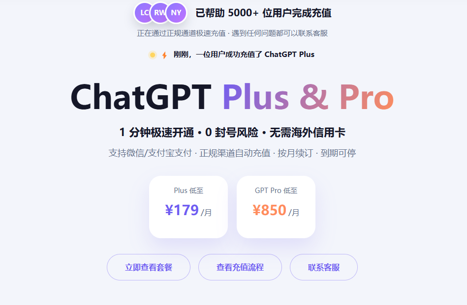

# ChatGPT Plus 国内怎么充值？2026 年常见方法与省心方案

想升级 ChatGPT Plus，真正让国内用户头疼的往往不是怎么使用，而是怎么付款。打开升级页面后，有人发现银行卡无法通过，有人不想折腾 Apple ID，也有人试了虚拟卡，却卡在开卡、充值和账单地址上。

如果你正在搜索“ChatGPT Plus 国内怎么充值”，可以先记住一个简单结论：有受支持的支付方式，优先选择官网或官方 App；没有海外信用卡，又希望用支付宝或微信完成付款，可以了解第三方代充，但选择前必须核对账号安全、订单记录和售后规则。

## 充值前先弄清楚：你买的是 Plus 订阅

ChatGPT Plus 是 ChatGPT 的个人付费订阅。OpenAI 帮助中心当前标注的价格为 20 美元/月，按月计费。Plus 通常提供比免费版更高的使用限额、更广泛的模型和工具访问，以及文件分析、图片生成和 Deep Research 等功能；具体模型和额度会变化，应以自己账号中的升级页面与模型选择器为准。

Plus 不包含 OpenAI API 额度。网页端订阅和开发者 API 是两套独立计费系统，购买 Plus 并不会自动获得 API 余额。

## 国内常见的四种充值方式

### 1. 官网使用受支持的银行卡

这是最直接的路径：登录 ChatGPT，进入升级页面，选择 Plus 并在官方结账页付款。

它的优势是订阅归属、账单和取消入口都比较清楚；不足是卡片、发卡地区、账单资料和用户所在地需要满足平台要求。卡面带有 Visa 或 Mastercard 标识，也不代表一定能通过支付风控。

如果连续支付失败，不建议反复更换虚假地址或来历不明的卡片。失败次数过多，可能让支付流程变得更麻烦。

### 2. 官方 App 与 App Store

苹果用户可以在官方 ChatGPT App 中查看是否支持 Plus 内购。部分用户会购买与 Apple ID 地区匹配的礼品卡，再使用账户余额订阅。

这种方式不需要把 ChatGPT 账号交给第三方，但要处理 Apple ID 地区、礼品卡来源、余额、税费和订阅管理。礼品卡地区不匹配，通常无法正常兑换。

### 3. 虚拟信用卡

虚拟卡过去是常见方案，但它并不等于“申请一张卡就一定成功”。开卡费、充值费、换汇成本、卡段风控和续费失败都需要考虑。如果服务商突然停止运营，卡内余额也可能难以取回。

这条路更适合熟悉跨境支付的人。只想开通一次 Plus 的新手，往往要付出不少学习和试错成本。

### 4. 支付宝或微信代充

代充的核心价值，是把海外支付环节交给服务商处理，用户使用人民币下单。它适合没有海外信用卡、不想研究虚拟卡、希望保留自己账号，或者需要订单和客服跟进的人。

不过，代充并不是 OpenAI 官方付款渠道。平台是否可靠，要看流程是否透明、是否有订单查询、失败怎么处理，以及是否索取敏感凭证。

## 为什么很多国内用户会选择代充？

从实际操作看，代充解决的是三类问题：

- 不用自己准备海外信用卡；
- 可以使用熟悉的支付宝或微信付款；
- 出现到账延迟或订单异常时，有明确的查询和客服入口。

如果你希望查看当前套餐，可以进入 [LoveYouAI ChatGPT 充值页面](https://www.loveyouai.cn?ref=1221)。页面截图显示 Plus 套餐低至 179 元/月，实际售价、库存和活动以下单页面实时信息为准。

> 图片位置建议：放在代充方案介绍之后。图片说明应注明“价格和活动以页面实时显示为准”。

## ChatGPT Plus 代充的一般流程

不同平台细节可能不同，但通常包括以下步骤：

1. 确认自己的 ChatGPT 账号可以正常登录；
2. 选择 Plus 套餐并阅读商品说明；
3. 使用支付宝或微信完成付款；
4. 保存订单号，按照页面流程操作；
5. 等待订阅状态更新；
6. 回到 ChatGPT 设置中的套餐页面核对是否到账。

已经订阅 Plus 的用户，下单前还应确认新订阅是否会影响剩余时间。不要默认多次充值一定能够叠加。

## 选择代充平台时重点看什么？

价格不是唯一标准。至少检查以下项目：

- 网站是否明确标注商品和实际价格；
- 能否查询订单进度；
- 失败、超时和退款规则是否公开；
- 是否有可以联系的客服；
- 是否要求提交密码、邮箱验证码或双重验证代码；
- 是否诱导安装远程控制软件；
- 完成后能否在官方账号中验证订阅状态。

Cookie、Session Token、AuthSession 等登录会话数据也属于敏感凭证。如果某个流程需要此类信息，必须先了解它的权限、用途、保存时间和撤销方式，不能把它理解成“零风险”。

## 常见问题

### 国内银行卡可以直接订阅 Plus 吗？

是否成功取决于卡片、地区、账单资料和支付风控。能进行国际支付的银行卡也可能被拒绝，应以官方结账页结果为准。

### Plus 充值后多久能看到？

到账时间取决于支付和订阅同步状态。不要相信无条件的“百分之百一分钟到账”承诺；完成后应到 ChatGPT 账号设置中核对。

### 代充需要提供账号密码吗？

不应把 ChatGPT 密码、邮箱密码、验证码或恢复代码交给客服。遇到此类要求，应停止操作。

### Plus 可以使用 Codex 吗？

具体权限应以 OpenAI 当前套餐页面为准。不同套餐和时期的模型、工具及用量限制可能调整。

### Plus 包含 API 吗？

不包含。ChatGPT Plus 和 OpenAI API 分开计费。

## 总结

ChatGPT Plus 国内充值没有适合所有人的唯一答案。有受支持银行卡的人，官网直付最清晰；熟悉苹果生态的人，可以考虑官方 App；了解跨境支付的人，才适合研究虚拟卡；没有海外信用卡、希望支付宝或微信付款的人，则可以比较代充平台。

无论选择哪一种，都要确保账号由自己掌控、订单可以追踪、失败规则清楚，并拒绝交出密码和验证码。需要人民币充值方案时，可 [查看 LoveYouAI 当前套餐与充值流程](https://www.loveyouai.cn?ref=1221)。

## 参考与内链建议

- 官方参考：[OpenAI ChatGPT Plus 说明](https://help.openai.com/en/articles/6950777-chatgpt-plus-)
- 内链建议：ChatGPT Plus 代充安全吗、支付宝微信充值教程、Plus 与 Pro 区别。
- 事实核验：发布前核对 LoveYouAI 实时价格、到账说明、退款政策和客服入口。
